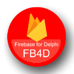

# FB4D – The OpenSource Cross-Platform Library for _Firebase_

The _Google Firebase Cloud Database_ is used in many mobile and web applications worldwide and there are well-documented libraries for many languages and platforms. For Delphi, the cross-platform library **FB4D** supports the _Firestore Database_, the _Firebase Realtime Database_, the _Firebase Storage_ (for file storage), _Firebase Functions_ (for calling server functions), and _Vision ML_. For authentication, **FB4D** currently supports email/password authentication, login by using a Google Account, and anonymous login. 

The library builds on the _Firebase REST-API_ and provides all functionality with synchronous and asynchronous methods for use within GUI applications, services, and background threads. Both frameworks _VCL_ and _Firemonkey_ are supported. The library is a pure source code library that relies on class interfaces. For clean and short application code, it supports fluent interface design.

### Wiki

This project offers a [wiki](https://github.com/SchneiderInfosystems/FB4D/wiki). Seven cross-platform example applications based on Firemonkey and three VCL sample applications and a [Getting-Started](https://github.com/SchneiderInfosystems/FB4D/wiki/Getting-Started-with-FB4D) on the wiki will help you to start working with the library. For more detailed questions, the [interface reference](https://github.com/SchneiderInfosystems/FB4D/wiki/FB4D-Interface-Reference) will provide the answers you need.

You can find more learning videos on the following [YouTube channel](https://www.youtube.com/channel/UC3qSIUzdGqoZA8hcA31X0Og).

### Major Change log

This log informs about interface changes and significant library enhancements that need the attention of users of this library.

- March 2025: Add authentication by using Google Accounts. The _DemoFB4D_ App demonstrates the functionality after setting up the Firebase Project for using this auth provider. Check the wiki for details.
- October 2024: _GeminiAI_ service added, a new tab in the _DemoFB4D_ App demonstrates the functionality;
- August 2024: Refactoring and many improvements in _DemoFB4D_ App;
- June 2024: Adding _TOTDMapperOptions_ to control the behavior of the Object-To-Doc mapper. The simple FMX demo application _FSObj2Doc_ demonstrates the Object-To-Document Mapper and has been added to the FB4D Samples project group. Add _IFirestoreWriteTransaction.TransformDoc_ for SetServerTime, Increment, Maximum, Minimum;
- February 2024: Migrate to Delphi Athene;
- December 2023: The Object to Document Mapper lets you quickly sync your Pascal objects to the Firestore database by deriving your own class from _TFirestoreDocument_ and adding member variables. All member variables are automatically written to the document and read from the document. The sample application _FSObj2Doc_ demonstrates the functionality;
- October 2023: Firestore database write transaction supports deleting documents too. The _Auth_SelfReg_VCL_ demo application explains all options of the self-registration workflow;
- June 2023: Firestore database supports write transactions;
- October 2022: Interface for _ML Vision_ service added;
- April 2021: Revised _RT DB_ Listener;
- March 2021: New optional cache to accelerate the repeated access to storage objects. Additional _IFirebaseStorage.GetAndDownload_ method to simplify the download from the storage. [See more details](https://github.com/SchneiderInfosystems/FB4D/wiki/FB4D-Reference-IFirebaseStorage#optional-cache-for-storage-objects)  
New option in _FB4D.SelfRegistrationFra_ framework to support entering display name and uploading profile image when registering a new user. [See more details](https://github.com/SchneiderInfosystems/FB4D/wiki/Self-Registration-Workflow#optional-user-profile-image)  
Real-Time database creation has changed within the Firebase Console. The Firebase ID is no longer sufficient to access newly created RT DBs. A Firebase URL is now required, which can also include the server location. [See more details](https://github.com/SchneiderInfosystems/FB4D/wiki/FB4D-Reference-IRealTimeDB#create-an-instance-for-the-interface-irealtimedb).  
A new listener detects changes within the Firestore Database without pooling. [See more details](https://github.com/SchneiderInfosystems/FB4D/wiki/FB4D-Reference-IFirestoreDatabase#firestore-listener).

### Prerequisites

The sample projects are developed and prepared for **Delphi 12.3 Athens**.

🔺 This library requires at least **Delphi 11.0 Alexandria**🔺. 

#### Hint: Support from Delphi 10 Seattle to Delphi 10.2 Tokyo has been discontinued since the introduction of the Firestore Listener in March 2021. Delphi 10.3 Update 1 and earlier versions are no longer supported because of an issue in the RTL. Delphi 10.4 Support is removed since FB4D V1.8.0 because of missing TBase64StringEncoding. 

Delphi is a registered trademark of [Embarcadero Technologies, Inc](https://www.embarcadero.com/de/products/delphi).

### Supported Platforms

**FB4D** is developed in pure object Pascal and can be used with _Firemonkey_ on all supported platforms. The library and its sample projects are currently tested with Win64/Win32, Mac64/32, and Linux64 by using FMXLinux, iOS64, and Android. (Hint to mobile platforms: The TokenJWT to perform the token verification requires the installation of the OpenSSL libraries). For more information about using OpenSSL see the [installation of OpenSSL](https://github.com/SchneiderInfosystems/FB4D/wiki/Getting-Started-with-FB4D#install-openssl)

#### Hints for Windows 

In the _DemoFB4D_ app, the Edge web browser is used to display Markdown as HTML and PDF. To do this, it is necessary to install the WebView2 SDK or at least copy the WebView2Loader.dll into your executable directory. Read more about WebView2 and TWebBrowser on Embarcadero's Wiki. This upgrade is only necessary under Win32 and Win64. 

#### Limitation on Android for VisionML

_AnnotateFile_ is limited to PDF only, as GIF support does not work due to [RSP-17682](https://quality.embarcadero.com/browse/RSP-17682), and the TIF image format is not yet supported.

#### Limitation on iOS for VisionML

_AnnotateFile_ is limited to PDF only, as the GIF and TOF image format is not yet supported by FMX.Graphics. You cannot convert a _TBitmap_ to one of the image formats required by VisionML with the standard library.
 
#### Limitation on Linux64

There are no restrictions when using Delphi 11 Alexandria or higher.

### Submodules

**Important note about path changes:** 
Since the introduction of Gemini AI (V1.6.5.631) the folder JOSE has been moved to _submodules/delphi-jose-jwt_ because the additional submodule _Delphi-Markup_ was added. After GIT pull, please update both submodules with the Git Bash command `git submodule update --remote --merge` or use your favorite Git tool for this update. 

#### Delphi-JOSE-JWT

For authorization token verification and token content extraction this library uses the Delphi JOSE JWT library. Thank you, Paolo Rossi for your great library!

[github.com/paolo-rossi/delphi-jose-jwt](https://github.com/paolo-rossi/delphi-jose-jwt)

#### Delphi-Markdown

For converting markdown formatted text into HTML this library uses the Delphi Markdown Library. Thank you, Grahame Grieve for this great library!

[github.com/grahamegrieve/delphi-markdown](https://github.com/grahamegrieve/delphi-markdown)

# Sponsoring FB4D

I recommend that anyone using this open-source library in a commercial project should consider sponsoring it. This is the only way this valuable library can be maintained and further developed. [Read more about the benefits of sponsoring here](github.com/SchneiderInfosystems/FB4D/wiki/Sponsorships-and-Support-Request-for-FB4D).

Christoph Schneider, Schneider Infosystems AG, Switzerland
[www.schneider-infosys.ch](https://www.schneider-infosys.ch)  

